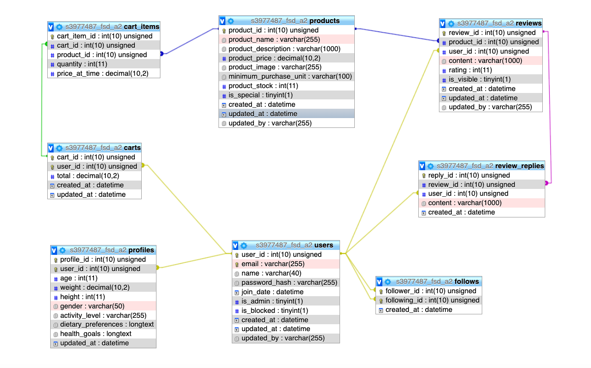

# SOIL Backend

SOIL Backend provides the server-side logic for the SOIL application, handling user interactions, product management, reviews, and shopping cart functionalities. Built with Node.js and Express, it integrates with a Sequelize ORM for MySQL database management.

## Getting Started

### Prerequisites

- Node.js
- Express.js
- MySQL

### Installation

Clone the repository and install dependencies.

git clone https://github.com/rmit-fsd-2024-s1/s3977487-s3987749-a2.git
cd backend
npm install

### Configuration
1. Database Configuration:
- Modify src/config/config.js to set your database connection settings.

2. JWT Secret Key:
- Set your JWT secret in src/config/config.jwt.js. It's crucial for your JWT authentication.

3. Server Configuration:
- Define your server port and other configurations in src/config/config.server.js.

### Running the Server
To start the server, run:

npm start

This will start the Express server on the port defined in your environment variables or configuration file.

## Database ER Diagram

#### ERD Schema Components:
1. Users
    * user_id: Primary Key, auto-incremented.
    * email: Unique email for each user.
    * name: User's full name.
    * password_hash: Stored password in a hashed format.
    * join_date: Date when the user account was created.
    * is_admin: Boolean to determine if the user has admin privileges.
    * is_blocked: Boolean to determine if the user is blocked by admin.
    * created_at (DateTime) or join_date
    * updated_at (DateTime)
    * updated_by email of admin who blocked
2. Profiles
    * profile_id: Primary Key, auto-incremented.
    * user_id: Foreign Key from Users.
    * age: User's age.
    * weight: User's weight.
    * height: User's height.
    * gender: User's gender.
    * activity_level: Describes the user's daily activity level.
    * dietary_preferences: Stores dietary preferences like vegetarian, vegan, etc.
    * health_goals: Stores user’s health goals like weight loss, muscle gain, etc.
    * updated_at (DateTime)
3. Products
    * product_id: Primary Key, auto-incremented.
    * product_name: Name of the product.
    * product_description: Description of the product.
    * product_price: Price of the product.
    * product_image: URL or path to the product's image.
    * minimum_purchase_unit: Minimum quantity that can be bought (e.g., 200 grams).
    * product_stock: Quantity availabe in inventory
    * is_special: Boolean to check if it is a special product.
    * created_at (DateTime)
    * updated_at (DateTime)
    * updated_by email of admin who updated
4. Reviews
    * review_id: Primary Key, auto-incremented.
    * product_id: Foreign Key from Products.
    * user_id: Foreign Key from Users.
    * content: Review text content, max 100 words.
    * rating: Star rating given by the user.
    * is_visible: Boolean to control the visibility of reviews without permanently deleting/admin feature
    * created_at: Date when the review was created.
    * updated_at: Date when the review was last updated.
    * updated_by email of admin who deemed the review.
5. Review_Replies
    * reply_id: Primary Key, auto-incremented.
    * review_id: Foreign Key from Reviews.
    * user_id: Foreign Key from Users.
    * content: Reply text content, max 100 words.
    * created_at: Date when the reply was created.
6. Cart
    * cart_id: Primary Key, auto-incremented.
    * user_id: Foreign Key from Users, unique constraint to ensure one-to-one relationship.
    * total: Total cost of items in the cart.
    * created_at (DateTime)
    * updated_at (DateTime)
7. Cart_Items
    * cart_item_id: Primary Key, auto-incremented.
    * cart_id: Foreign Key from Cart.
    * product_id: Foreign Key from Products.
    * quantity: Quantity of the product added to the cart.
    * price_at_time: Price of the product at the time it was added to the cart.
8. Follows
    * follower_id (Foreign Key from Users)
    * following_id (Foreign Key from Users)
    * created_at (DateTime)

#### Normalization Review:
1. First Normal Form (1NF):
    * All tables have primary keys (e.g., user_id, profile_id, product_id, etc.), ensuring that each record is uniquely identifiable.
    * Each column contains atomic values without repeating groups or arrays.
2. Second Normal Form (2NF):
    * All tables meet the 2NF because each table's attributes are fully functional and solely dependent on the primary key. For example, in the Profiles table, non-key attributes like age, weight, and activity_level depend directly on the profile_id.
3. Third Normal Form (3NF):
    * Tables appear to adhere to 3NF as there are no transitive dependencies between non-key columns. For instance, user details related to authentication and administration (password_hash, is_admin, is_blocked) are kept separate from profile details like age and weight.
4. Boyce-Codd Normal Form (BCNF):
    * The schema adheres to BCNF as every determinant is a candidate key, which means no non-trivial functional dependencies exist where a non-candidate key determines another non-candidate key.

#### Entity-Relationship Diagram (ERD) Considerations:
1. Users to Profiles
* One-to-One Relationship: Each user in the Users table has exactly one corresponding profile in the Profiles table. This is modeled through a foreign key (user_id) in the Profiles table that references the primary key (user_id) of the Users table.
2. Users to Reviews
* One-to-Many Relationship: A single user can author multiple reviews, but each review can only be authored by one user. This is implemented by the user_id foreign key in the Reviews table pointing to the user_id primary key in the Users table.
3. Products to Reviews
* One-to-Many Relationship: Each product can have multiple reviews written about it, but each review pertains to only one product. The product_id foreign key in the Reviews table links to the product_id primary key in the Products table.
4. Reviews to Review_Replies
* One-to-Many Relationship: Each review can have multiple replies, where each reply is associated with only one review. The review_id foreign key in the Review_Replies table references the review_id primary key in the Reviews table.
5. Users to Cart
* One-to-One Relationship: Each user has exactly one cart associated with them. This is represented by a foreign key in the Cart table (say, user_id), which uniquely references the primary key (user_id) in the Users table.
6. Cart to Cart_Items
* One-to-Many Relationship: Each cart can contain multiple items, but each item is linked to one specific cart. This is handled by the cart_id foreign key in the Cart_Items table, which references the cart_id primary key in the Cart table.
7. Products to Cart_Items
* One-to-Many Relationship: Multiple cart items can contain the same product (across different users or even within the same cart if listed separately). The product_id in Cart_Items references the product_id in Products.
8. Users to Follows (Following and Followers)
* Many-to-Many Relationship: This is a self-referencing relationship where users can follow other users. The Follows table acts as a junction table with two foreign keys (follower_id and following_id), both pointing to the user_id in the Users table. Each user_id can appear multiple times in follower_id and following_id columns, representing different relationships.

### Implementation details: 
- Cross-Cutting Concerns:
* Authentication and Authorization: Implement strategies like JWT for handling authentication and managing user sessions securely.
* Error Handling: Develop a robust error-handling strategy that includes centralized error handling and standardized response formats for API errors.
* Configuration Management: Used configuration files to manage application settings and secrets securely.

- Development Principles
* DRY (Don't Repeat Yourself): Aim to have a single source of truth in your code to minimize repetition.
* KISS (Keep It Simple, Stupid): Avoid unnecessary complexity in your implementations.
* SOLID Principles: These are five principles of object-oriented design that promote a cleaner, more scalable system.

### Controllers
1. UserController: Manages user registration, authentication, and profile management.
2. ProductController: Handles product listings and product-specific operations.
3. ReviewController: Manages product reviews and interactions.
4. CartController: Handles all operations related to the shopping cart.

### UNIT TEST

- Run test : npm test
- Individual test : npm test -- reviewController.test.js, npm test -- cartController.test.js

1. reviewController.test.js
- Overview: 
The reviewController.test.js is designed to rigorously test the functionality of the reviewController, which handles operations related to managing reviews within an application. This testing suite is built using jest for mocking and assertions, and supertest for making HTTP requests to the express application. These tests ensure that the review management features of the application function correctly under various scenarios.
- Test Setup
* Module Imports: Necessary modules like supertest for HTTP requests and express for creating an express application are imported.
* Authentication Mock: The authenticate middleware is mocked to simulate an authenticated user environment without actual authentication logic. This helps in focusing the tests solely on the functionality of the review controller.
* App Initialization: Before each test, an express application instance is created and configured to use JSON through express.json().
* Route Setup: The review routes are setup by passing the express app and the mocked database object, allowing the review controller's endpoints to be tested.
- Database Mock
The database (db) is mocked to simulate interactions with a database:
* Models: Mock functions are created for the Review, User, Product, and ReviewReply models, which allow us to simulate database operations like creating and finding records without an actual database.
- Test Cases
* Add Review - Successful: Tests the scenario where a review is successfully added. This involves mocking the Review.create and Review.findByPk methods to simulate the creation and retrieval of a review. Assertions check the HTTP status code and the response body to ensure the review is added correctly.
* Fetch Reviews - Successful: Focuses on retrieving reviews for a specific product. This test mocks Review.findAll to simulate the database returning a list of reviews. It verifies that the response contains the correct data and HTTP status.
Assertions
Each test case uses assertions to verify:
* HTTP Status Codes: Each response's status code is checked to match the expected outcome (e.g., 200 for success, 201 for creation).
* Response Body: The content of the HTTP response is checked to ensure that it contains the correct data structures and messages expected from the operation.
- Conclusion: 
The test suite in reviewController.test.js is crucial for ensuring that the review management functionality of the application is robust, performs as expected, and handles edge cases gracefully. By mocking database interactions and simulating authenticated sessions, these tests can run quickly and reliably without side effects, making them an essential part of the development process for maintaining high-quality code and functionality.

2. cartController.test.js
- Overview: 
The cartController.test.js is a comprehensive testing suite for the Cart Controller functionalities within an Express application. This suite uses Jest for function mocking and assertions, and Supertest for making HTTP requests. The tests are designed to validate the correctness of CRUD operations on the shopping cart under a simulated user authentication scenario.
- Testing Strategy
* Authentication Simulation: Authentication is mocked to bypass actual login mechanisms, assuming the user is always authenticated. This setup focuses the tests on the cart functionalities without dependencies on the authentication logic.
* Database Mocking: The database interactions are simulated using Jest to mock the responses from database methods. This approach allows the tests to run independently of the actual database, ensuring that tests are not affected by the database state and are repeatable.
* Express Application Setup: An Express application instance is configured for each test, with JSON parsing and route handling set up to mimic the production environment's configuration.
- Test Descriptions
1. Get Cart - Successful:
    * Purpose: Tests successful retrieval of a cart for a given user ID.
    * Process: Simulates a database response for finding a cart and asserts that the HTTP response is correct and includes the expected cart details.
    * Assertions:
        * HTTP status should be 200 OK.
        * The response should include specific cart details, confirming that the cart data is correctly retrieved and formatted.
2. Add Item - Successful:
    * Purpose: Validates that an item can be successfully added to a user's cart.
    * Process: Mocks the database operations to simulate finding or creating a cart and adding an item to it. Checks that the operation responds with the appropriate success message and status.
    * Assertions:
        * HTTP status should be 201 Created.
        * The response should confirm the item was added, with details reflecting the added item.
3. Remove Item - Successful:
    * Purpose: Ensures that an item can be removed from the cart successfully.
    * Process: Simulates the item removal process by mocking the cart and item existence and successful deletion.
    * Assertions:
        * HTTP status should be 200 OK.
        * The response should confirm successful removal with an appropriate message.
4. Remove Item - Item Not Found:
    * Purpose: Tests the response when attempting to remove an item that does not exist in the cart.
    * Process: Configures mocks to simulate the absence of the specified item in the cart and checks that the service responds correctly to this situation.
    * Assertions:
        * HTTP status should be 404 Not Found.
        * The error message should indicate that the item was not found or is not in the cart.
5. Remove Item - Cart Not Found:
    * Purpose: Checks the system's response when an operation is performed on a non-existent cart.
    * Process: Mocks the database to return no cart for the given user and verifies that the attempt to remove an item handles this gracefully.
    * Assertions:
        * HTTP status should be 404 Not Found.
        * The error message should indicate that the cart does not exist, confirming the system's robust handling of such cases.
- Conclusion: 
The cartController.test.js ensures that the cart management functionalities of the application are robust, correctly implemented, and secure from common issues. By isolating the application logic from external dependencies such as the actual database and authentication system, these tests provide a reliable and efficient means to continuously validate the business logic and error handling of the cart operations. This approach greatly enhances the development process, providing quick feedback and assurance of feature correctness during development cycles.

